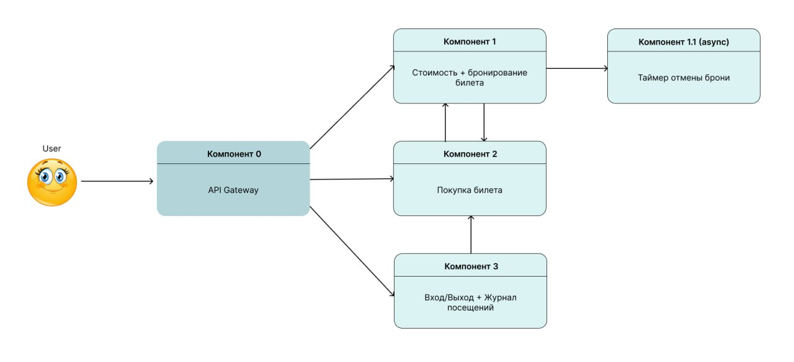

# RailsLiga

## Команда №2

### Выпилнили:
    - Седов Артём Михайлович 
    - Таран Анжелика Александровна
    - Думаревская Татьяна Николаевна

## Список компонентов 

## Запуск проекта

* Сначала соберем проект:

`docker compose build`

* Затем запустим:

`docker compose up`

* Создадим и применим миграции для каждого компонента:

- Для компонента reservations:

`docker compose run --rm reservations db:create`

`docker compose run --rm reservations db:migrate`

- Затем заполним таблицу Category:

`docker compose run --rm reservations rails c`

`Category.create(category: "VIP", quantity: 50, c_cost: 1000)`

`Category.create(category: "FAN", quantity: 150, c_cost: 500)`

- Для компонента purchase:

`docker compose run --rm purchase db:create`

`docker compose run --rm purchase db:migrate`

- Для компонента turnstile:

`docker compose run --rm turnstile db:create`

`docker compose run --rm turnstile db:migrate`

## Тестирование 

Проект реализован с использованием API на основе Gateway с поддержкой Swagger. Для доступа к API перейдите по адресу `localhost:3000/swagger`.

Чтобы проверить работу компонентов необходимо выполнить следующие действия:

Сначала создается бронь:
- POST /reservations

Потом покупаем билет: 
- POST /purchase

Далее пройдем на концерт: 
- POST /turnstile

    
